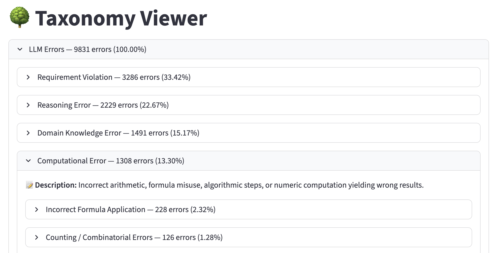

# ErrorMap: Charting the Failure Landscape of LLMs

ErrorMap is an open-source library for error analysis, designed to evaluate the failure patterns of large language models (LLMs). 
It provides tools to extract a model's unique "failure signature", uncover what benchmarks actually measure in practice, and broaden the scope of identified model errors to reduce blind spots. It implements the methodology from the paper:
"ErrorMap and ErrorAtlas: Charting the Failure Landscape of Large Language Models".

Given benchmark-style results, ErrorMap supports both granular and holistic analysis of model failures. Its workflow and output includes:

1. **Per-Instance Error Analysis** - Provides detailed breakdowns of errors for each individual instance, enabling precise diagnostics.

2. **Recursive Error Taxonomy Construction** - Builds a hierarchical taxonomy of errors in a recursive manner, summarizing common failure types and their frequencies. This structure facilitates intuitive navigation and deeper understanding of error patterns.

These results can then be explored through our interactive application, making analysis accessible.

This makes ErrorMap an ideal tool for anyone aiming to understand, compare, or improve the performance of LLMs. It also serves as a valuable resource for benchmark and dataset creators, helping to articulate the specific challenges that models encounter.

### Example of Output in Our Interactive App

The output is a taxonomy of model errors, where each specific analyzed error is represented as a leaf node in a hierarchical tree. Errors that reflect failures in similar underlying skills are grouped together across multiple layers, forming a multi-level structure that highlights shared patterns among error types.

The screenshot below demonstrates how our interactive app makes this output accessible and easy to navigate, allowing users to explore the hierarchy and gain insights into model performance.



<p style="text-align: center; font-style: italic;">
Figure 1: Taxonomy Viewer – displaying error categories along with their frequency and descriptions, and enabling navigation across categories, sub-categories, and specific errors.
</p>


### Who Can Benefit From Using ErrorMap?

ErrorMap supports a range of users working with LLMs, including:

- **Model Developers** – Detect regressions and behavioral changes across model versions.
- **Benchmark Creators** – Analyze model capabilities and validate dataset quality.
- **Product Teams** – Select the best model for deployment based on error profiles.
- **Domain Experts** – Surface failure modes in specialized contexts.
- **LLM Researches** – Gain insights about model behaviors for future research.


## Quick Start

### 1. Installation

Clone the Repository
```bash
git clone git@github.com:IBM/ErrorMap.git
cd ErrorMap
```

Create a virtual environment
```bash
python -m venv .venv
```

Activate the venv
```bash
source .venv/bin/activate
```

Install with `uv` (recommended)
```bash
uv pip install -e .
```

Or install with `pip`
```bash
pip install -e .
```

### 2. Prepare Your Data

Create one or more CSV files in the `data/` directory. These files should contain model evaluation results and follow a specific format.

**Required columns:**
- `example_id` - Unique example identifier
- `model` - Model name
- `input_text` - Original input (IMPORTANT: Ensure it includes all instructions and any necessary context required to answer. For example, in multiple-choice tasks, candidate answers must be part of the `input_text`.)
- `output_text` - Model's response
- `score` - Performance score
- `correct_answer` - Expected answer (optional)
- `dataset` - Dataset name (auto-added)

**Example CSV Row**
```csv
index,example_id,model,input_text,output_text,score,correct_answer
0,ex_1,your_model,"What is 2+2?","If you add 2 to 2 you get 4",1,"4"
```

### 3. Configuration

You can use any provider supported by LiteLLM to run model inference. Depending on your chosen provider, you’ll need to set the appropriate environment variables.

For example, for azure:
```bash
export AZURE_API_KEY="your_api_key"
export AZURE_API_BASE="https://your.azure.endpoint"
```

> Note: LiteLLM supports multiple providers including OpenAI, Azure, RITS, Anthropic, and more. Refer to the LiteLLM documentation for full details on supported engines and required environment variables.

### 4. Basic Usage

Suppose you want to analyze the failure modes of the model `meta/llama-3.1-70b-instruct-turbo` on the `OmniMATH` dataset. You prefer using `gpt-3.5-turbo` as the judge model, and you're interested in identifying common error patterns by sampling 20% of the errors.

```python
import asyncio
from error_map import run
import os

async def main():
    result = await run(
        inference_type="litellm",           # Required for actual inference (not a mock run)
        litellm_config = {                  # LiteLLM config that includes your preferred provider, model analyst and params
            'model': 'azure/Azure/gpt-4o',
            'api_key': os.getenv('AZURE_API_KEY'),
            'api_base': os.getenv('AZURE_API_BASE'),
            'max_tokens': 2000,
            }        
        datasets=["omni_math"],             # Dataset names (match CSV filenames without .csv extension)
        dataset_params={                    # Dataset params (in case you wish for specific thresholds)
            "omni_math": {
                "success_threshold": 0.9    # Outputs with score < 0.9 are considered errors
            }
        },
        models=["meta/llama-3.1-70b-instruct-turbo"],  # Models to analyze
        ratio=0.2                           # Sample 20% of errors for analysis
    )
    print(f"Processed {result['total_records']} records")
    print(f"Analyzed {result['error_records']} errors")

asyncio.run(main())
```

### 5. Command Line Interface

```bash
# Run with mock inference (default)
error-map --models your_model --ratio 0.1 --max-workers 10

# Run with LiteLLM (requires API setup)
error-map --inference-type litellm --models your_model --ratio 0.1 --max-workers 5

# Custom data path and datasets
error-map --data-path custom/data --datasets dataset1 dataset2 --max-workers 8

# Full CLI options
error-map --help
```

**CLI Options:**
- `--models` - Models to analyze (space-separated)
- `--ratio` - Error sampling ratio (0.0-1.0, default: 0.1)  
- `--seed` - Random seed for reproducibility (default: 42)
- `--inference-type` - Inference type: `litellm` or `litellm-mock` (default: litellm-mock) ***
- `--max-workers` - Max concurrent inference workers (default: 10)
- `--datasets` - Dataset names to process (space-separated)
- `--data-path` - Path to data directory (default: data)
- `--output-dir` - Path to outputs directory (default: output)
- `--provider` - Select your preferred provider
- `--judge` - Select the judge
- `--exp-id` - Custom experiment ID


### 6. Displaying the Resulting Taxonomy

A simple Streamlit app is provided to visualize the final taxonomy results. You can find it at:

```
src/app/app.py
```

To launch the app, run:

```bash
streamlit run src/app/app.py --server.maxUploadSize=2048
```

Then, upload your json output file.

> Adjust the `--server.maxUploadSize` value (in megabytes) based on the size of your final output file to ensure successful uploads.


This app provides an interactive interface for exploring the constructed error taxonomy, making it easier to analyze and present the results.


### Advanced Usage

```python
from error_map import ErrorMap

# Full control over configuration
error_map = ErrorMap(
    inference_type="litellm",           
    litellm_config = {                  
        'model': 'azure/Azure/o1',
        'api_key': os.getenv('AZURE_API_KEY'),
        'api_base': os.getenv('AZURE_API_BASE'),
        'temprature': 0,
        },
    exp_id="my_experiment",          # Custom experiment ID
    data_path="custom/data/path",    # Custom data directory
    datasets=["dataset1", "dataset2"],
    dataset_params={
        "dataset1": {"success_threshold": 0.8},
        "dataset2": {"success_threshold": 0.9}
    },
    max_workers=200,                  # Control async concurrency
    models=["gpt-4"], 
    ratio=0.05,
    use_correct_predictions=False,   # Avoid using other models' correct predictions as reference (this also helps save input tokens)
)

result = await error_map.run()
```

## Directory Structure

```
error_map/
├── core/
│   └── config.py           # Configuration management
├── inference/
│   └── client.py          # LiteLLM integration
├── stages/
│   ├── data_preparation.py # (1) Async data loading & sampling
│   ├── single_error.py     # (2) Error analysis
│   ├── recursive_taxonomy.py   # (3) Taxonomy construction in a recursive manner
│   ├── taxonomy_construction.py    # (3.1) Sub-stage: Categories extraction
│   ├── error_classification.py     # (3.2) Sub-stage: Error label classification to resulted categories
│   └── taxonomy_population.py      # (3.3) Sub-stage: Assignment of errors to categories
├── templates/
│   └── prompts/
│       ├── single_error_analysis.j2
│       ├── taxonomy_generation.j2
│       ├── taxonomy_update.j2
│       ├── taxonomy_review.j2
│       └── classify_errors.j2
│   └── response_schemas/
│       ├── single_error_schema.j2
│       ├── generate_taxonomy_schema.j2
│       ├── update_taxonomy_schema.j2
│       ├── review_taxonomy_schema.j2
│       └── classify_errors_schema.j2
└── utils/
    ├── taxonomy_tree.py
    ├── constants.py
    └── cache.py           # CSV caching system
```

## Output Files

Results are automatically cached in `output/` directory:
- `config__exp_id=<id>__*.json` - Experiment configuration details
- `exp_name=data_preparation__exp_id=<id>__*.csv` - Processed data with error flags
- `exp_name=single_error__exp_id=<id>.csv` - Individual error analyses
- `exp_name=construct_taxonomy_recursively__exp_id=<id>.csv` - Error taxonomy

The last file is the final result, and it includes all the required columns from the input for each instance, along with the following information:

| Column name        | Description |
|--------------------|-------------|
| **Judge Model**     | The model responsible for evaluating and identifying incorrect predictions. |
| **Judge Response**  | A JSON object containing a detailed analysis of a specific prediction instance. |
| **Error Label**     | A descriptive tag assigned to categorize the type of error. |
| **Error Summary**   | An explanation of the identified error. |
| **Category Depth X**| The most relevant category associated with the error, located at level X in the taxonomy hierarchy. |

*We further provide `exp_name=construct_taxonomy_recursively__exp_id=<id>.json` that includes the error taxonomy as a json object.

<!-- 
## Customizing Templates

Edit Jinja2 templates in `src/error_map/templates/prompts/`:

```jinja2
<!-- single_error_analysis.j2 -->
<!-- Analyze this LLM error:

Input: {{ input_text[:300] }}
Wrong Output: {{ output_text }}
Correct Answer: {{ correct_answer }}

What type of error is this? Be specific and concise.
``` -->
 <!-- -->

## Features

- **Fully asynchronous** – Concurrent file loading, data processing, and inference for maximum performance
- **Jinja2 templating** – Clean and maintainable prompt templates
- **LiteLLM integration** – Production-ready support for Azure and Rits providers
- **CSV caching** – Automatic intermediate result caching for reproducibility
- **Modular architecture** – Decoupled stages with a clean directory structure

## Performance

The system is designed for high performance:

- **Concurrent file loading** - Multiple CSV files loaded in parallel
- **Async inference** - All error records processed concurrently
- **Smart threading** - CPU-intensive work moved to thread pools for large datasets
- **Efficient caching** - Automatic CSV-based result caching

## Example Workflow

1. **Data Preparation** - Load CSVs, apply error thresholds, sample failures
2. **Error Analysis** - Generate prompts from templates, run inference concurrently
3. **Taxonomy Construction** - Build hierarchical error taxonomy from analysis results

Each stage is cached automatically, so re-runs only process new data.

## Development

```bash
# Install development dependencies
uv pip install -e ".[dev]"

# Run tests
pytest

# Format code
black src/
isort src/

# Type checking
mypy src/
```

## Architecture

- **Decoupled design** - Inference engine knows nothing about specific stages
- **Template-based** - All prompts use Jinja2 templates
- **Async-first** - Built for concurrent processing from the ground up
- **Backward compatible** - Maintains exact CSV format compatibility

## 🛠️ Troubleshooting

<details>
<summary><strong>Dataset not found</strong></summary>

- Ensure CSV files are located in the `data/` directory
- Dataset names should match the file name (without `.csv`)
</details>

<details>
<summary><strong>LiteLLM connection issues</strong></summary>

- Check `AZURE_API_BASE` and `AZURE_API_KEY` for Azure
- Use `inference_type="litellm-mock"` to test locally
</details>

<details>
<summary><strong>Memory issues with large datasets</strong></summary>

- Reduce the `ratio` parameter to sample fewer errors
</details>


## Citation

```bibtex
@misc{ashurytahan2026errormaperroratlaschartingfailure,
      title={ErrorMap and ErrorAtlas: Charting the Failure Landscape of Large Language Models}, 
      author={Shir Ashury-Tahan and Yifan Mai and Elron Bandel and Michal Shmueli-Scheuer and Leshem Choshen},
      year={2026},
      eprint={2601.15812},
      archivePrefix={arXiv},
      primaryClass={cs.AI},
      url={https://arxiv.org/abs/2601.15812}, 
}
